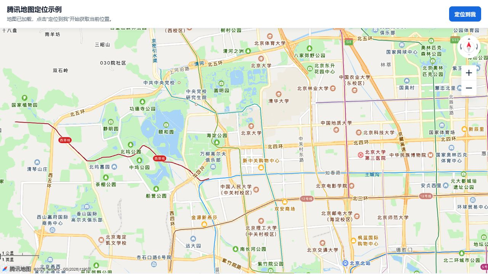

# 腾讯地图定位示例

这是一个最小静态页面示例，使用腾讯地图 JavaScript API GL 加载地图，使用浏览器 `navigator.geolocation` 获取当前位置，并调用腾讯地图逆地址解析接口显示地址。

## 运行

定位能力需要在 `localhost` 或 HTTPS 环境下运行。当前目录可直接执行：

```powershell
python -m http.server 5173
```

浏览器打开：

```text
http://localhost:5173/
```

## 预览



## 文件

- `index.html`：完整示例页面，已接入腾讯地图 key。
